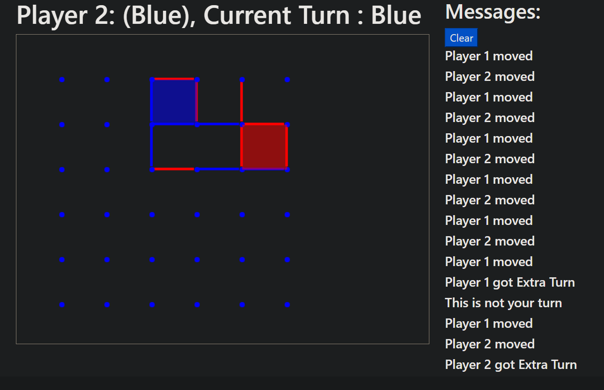

# Multiplayer Dots And Boxes

### Preview:


## Technologies Used
- Angular for SPA
- Socket.io to connect client messages across single server
- CreateJS for drawing
- RxJS for Reactive Programming
- Bootstrap for UI
- Node as Backend

## Installation
run this in shell
```
git clone https://github.com/Whispard/dots-and-boxes
cd dots-and-boxes
npm install
ng serve
```

Now, you can open 2 browsers with `http://localhost:4200` and play


